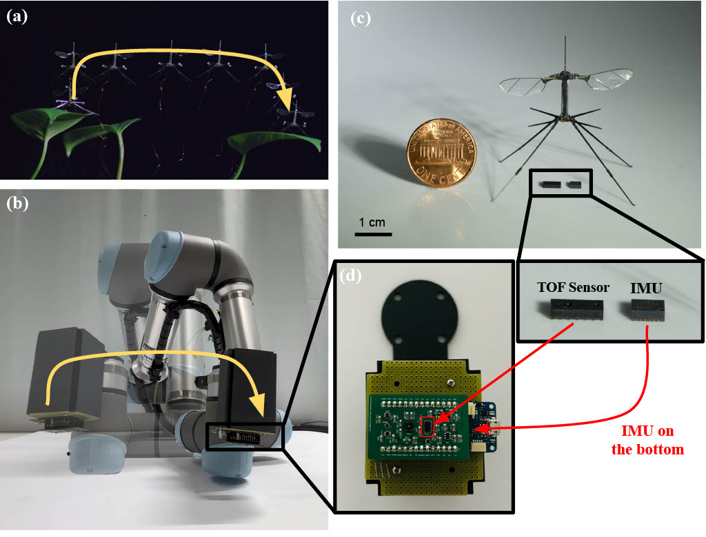

# FWMAV-State-Estimation

Official Code Repository for the paper.

In this repository, we implement the Complimentary Extended Kalman Filter for FWMAV as described in the paper. Furthermore we include the data collected from hardware in the loop experiments and simulated sensor data based on Robobee flight trajectories.

Additionally we include the PCB Designs and schematics used for the hardware experiments.

## Code Structure
We provide a MATLAB implementation and python implementation of the proposed algorithm. Furthermore the scripts that were run on the UR5 and arduino to collect the data are included for reference.

